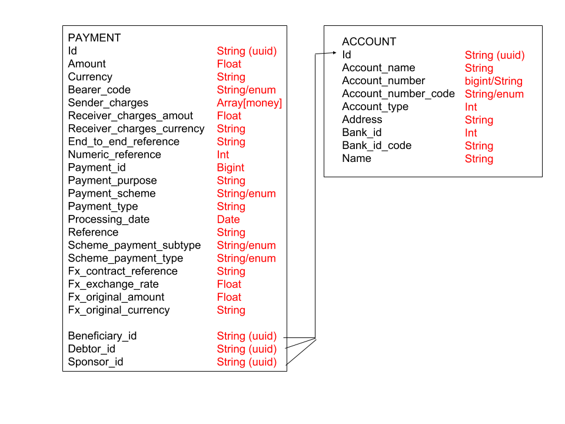
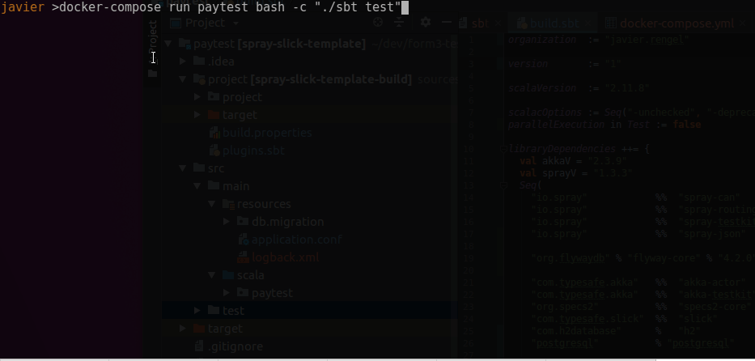
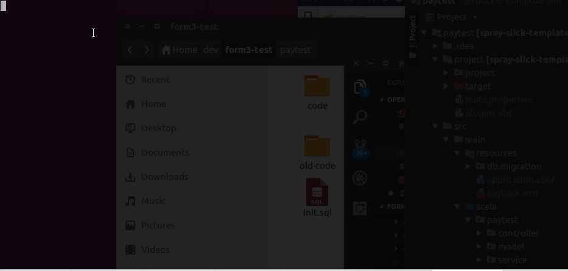
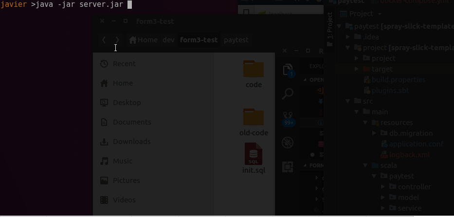
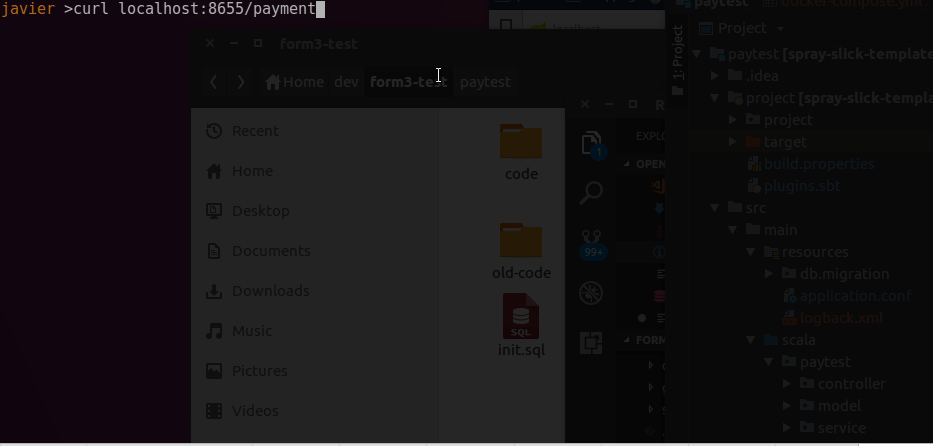

This REST api powered by Spray and persistence on Slick allows users to create, update and list payments and accounts. 



Libraries and frameworks: 
- Scala 2.11.8
- Spray: REST api
- Slick: Persistence
- Postgres/H2: Database drivers
- Flyway: To run DB migrations
- Specs2: Testing framework

## Endpoints

- GET /payment list all papyments
- GET /payment/[id] get payment by id
- POST /payment create new payment 
- PUT /payment/[id] update an existing payment 
- DELETE /payment/[id]

Extra endpoints for monitoring, useful when implementing a complex microservice stack:
- GET / return status and name of the app 
- GET /ping pong 

## Features 

- Database migrations using slick 
- Payment endpoint
- Status endpoint
- Postgres database on docker when running server, but H2 database for tests
- Added pagination (limit, from filters) on list of payments endpoint
- Comprehensive test coverage on tests, DB methods, API and serializers

### Project structure
This is the structure of the modules in the project, it follows the model-view-controller pattern.

- src/main/resources/db : Folder with all migrations tu run with Flyway
- src/main/resources/application.conf: Configuration file for the server
- src/main/scala/paytest: Where the code of the app is 
    - Boot: App entrypoint, we run DB migrations and initialize the Spray REST API service
    - controller: contains the endpoints, and their actions, response serialization happens implicitly
    - model: contains the classes and the DB mapping
    - view: contains the JSON serializers
    - service: contains the DB acctions (insert, select, update, delete...)

All tests are inside src/test/scala/paytest, following a similar model-view-controller structure. There is also another application.conf file with the H2 database details only for tests. 

## Implementation comments

This is the list of this that I did or didn't do, most of them don't provide any value to the showcase of this project, but they are used to simplify the implementation. 

- DB in postgres "paytest" is created on startup with the init.sql script on docker

- I'm using string instead of uuid db types to avoid library conflicts,
simplify tests and database compatibilities

- I'm generating randomStrings and randomFloats on every field on data and tests that are required, in order to avoid hardcoded false positives and import data faster

- jsonapi was not implemented as I undrestand this is a matter of updating the format accordingly and doesn't provide any value for this test 

- There is no endpoint to create, list or update accounts. If needed, only a new controller needs to be created.

## Things to do next 

This is a list of this that should be done before moving to a full environment. 

- Add security to API (uses profiles, access token, private network...)
- Filter payment results on queryparams 
- Version API 
- Add error reporting system (eg: Sentry)
- Add swagger and external documentation on API
- continuous integration / continuous deploy

## Testing



Run all test

    ./sbt ~test 

Run a particular test (regex) 

    ./sbt '~test-only *Serializer*' 

Or use docker instead 
    docker-compose run paytest bash -c "./sbt test"

## Run the server 



Before running the server, you will need to be running a postgres instance with a *paytest* database, you can run it on your machine using docker with 
    docker-compose up postgres 

Run with docker 

    docker-compose up paytest

Or use sbt

    ./sbt run 

Or use the already built java jar (sbt assembly)

    java -jar app.jar




## Sample usage: create a payment 



PK id UUID is generated automatically
```
curl -X POST http://localhost:8655/payment -H "Content-Type: application/json" -d'{
  "reference":"",
  "sender_charges":[
    {"amount":0.3476658,"currency":"EUR"},
    {"amount":0.5503485,"currency":"GBP"}
  ],
  "sponsor":null,
  "numeric_reference":833901495,
  "fx":{
    "contract_reference":"ZYvTBee",
    "exchange_rate":0.9312809109687805,
    "original_currency":"YDVf13O1",
    "original_amount":0.8121793270111084
  },
  "debtor":null,
  "amount":0.647894024848938,
  "scheme_payment_subtype":"",
  "id":"6218ace4-cb59-4a27-8733-4806962ac944",
  "payment_type":"z2XSji",
  "payment_id":-263217557,
  "receiver_charges_amount":0.5060580968856812,
  "scheme_payment_type":"m",
  "bearer_code":"",
  "debtor_id":"2",
  "currency":"GBP",
  "beneficiary":null,
  "beneficiary_id":"1",
  "payment_purpose":"EEpwK",
  "sponsor_id":"3",
  "end_to_end_reference":"pT7GOpWK0",
  "receiver_charges_currency":"USD",
  "payment_scheme":"83Cil",
  "processing_date":"2018-01-01"}
'
```
